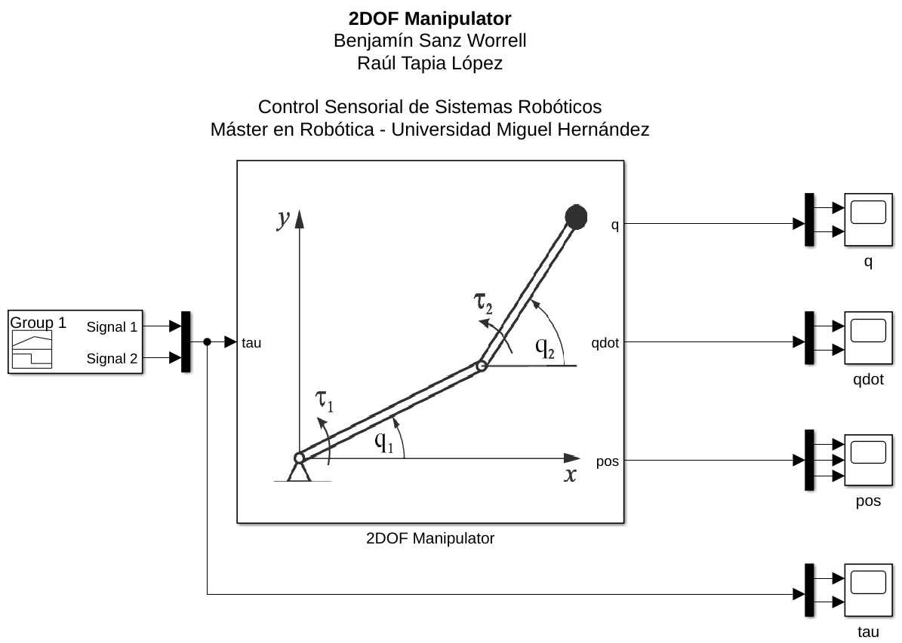
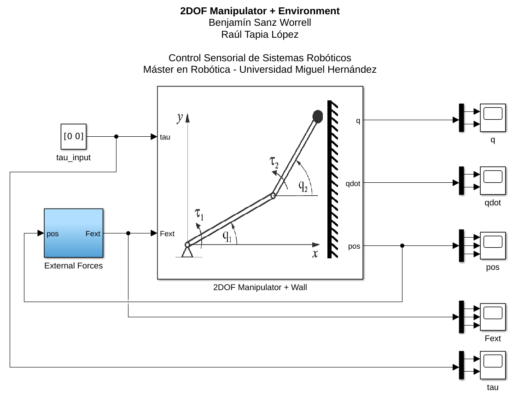
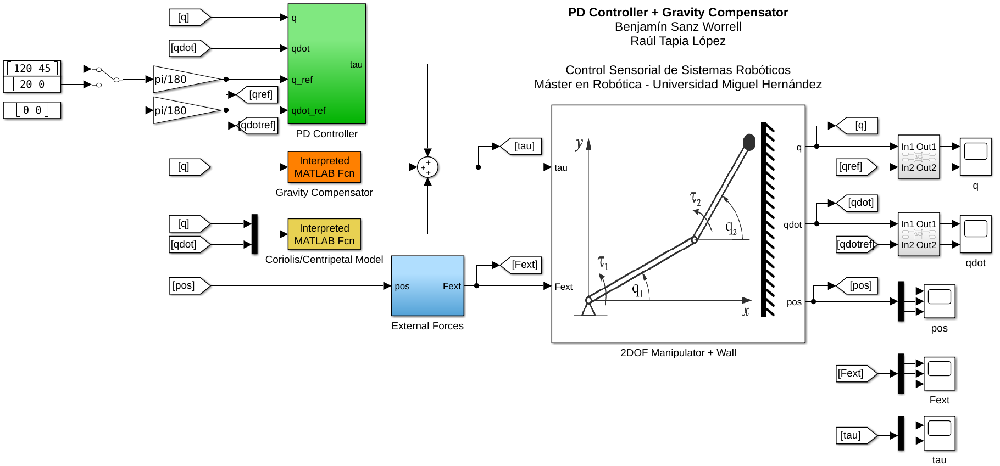
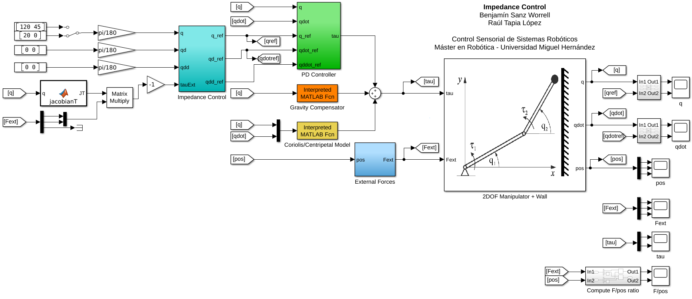
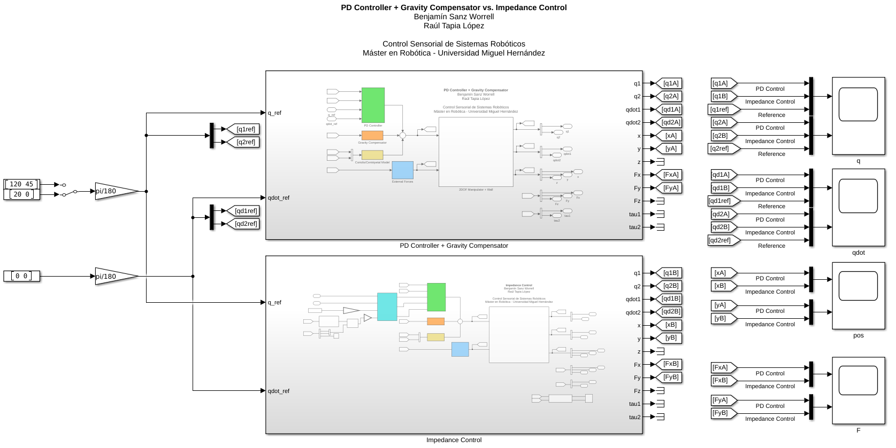

# Modelado y control de un robot manipulador de dos grados de libertad mediante SimMechanics / Simscape Multibody

## Capítulo 2: Modelado de un robot manipulador de 2 GDL

## Capítulo 3: Modelado del entorno

## Capítulo 4: Control PD con compensador de gravedad

## Capítulo 5: Control de impedancia

## Capítulo 6: Comparativa de los controladores implementados

